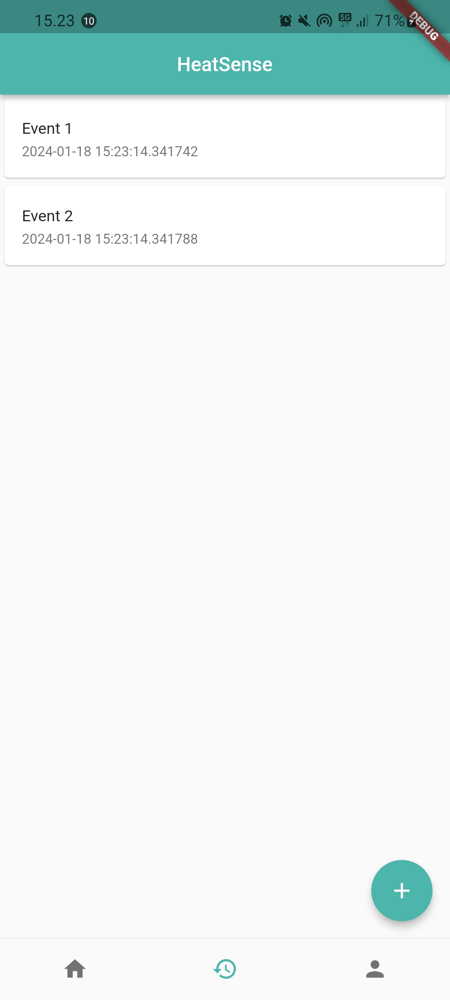
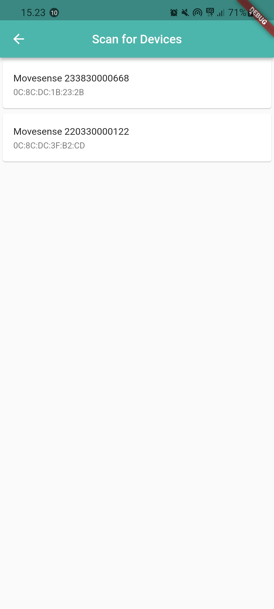

# HeatSense

This project creates a flutter application that is capable of showing sensor data from a MoveSense device. The device is used to measure Heartrate and body temperature. The app will use the data to warn the user about heatstrokes and create events that store data from a potential heatstroke.

We will be using the MoveSense Api (mdsflutter package) to communicate with the device. The application also uses the permission_handler plugin for flutter to handle permissions mainly about the usage of bluetooth.

### Scanning for MoveSense devices
The phone uses the bluetooth protocol to listen for devices. After listening a list of detected device(s) can be choosen.


```
Future<bool> get hasPermissions async =>
      await Permission.bluetoothScan.isGranted &&
      await Permission.bluetoothConnect.isGranted;

  /// Request the required Bluetooth permissions.
  Future<void> requestPermissions() async => await [
        Permission.bluetooth,
        Permission.bluetoothScan,
        Permission.bluetoothConnect,
      ].request();

  Future<void> init() async {
    if (!(await hasPermissions)) await requestPermissions();
  }

 @override
  void scan() async {
    _devices.clear();
    notifyListeners();

    await init();
    try {
      _isScanning = true;
      List<String> devicesadd = [];
      Timer(const Duration(seconds: 60), () => stopScan());
      Mds.startScan((name, address) {
        MovesenseHRMonitor device = MovesenseHRMonitor(address, name);
        print('Device found, address: $address');
        if (!devicesadd.contains(device.address)) {
          _devices.add(device);
          devicesadd.add(device.address);
          notifyListeners();
        }
      });
    } on Error {
      print('Error during scanning');
    }
  }
```

  ### Connect to selected device
  The app uses the connect() method to connect to a selected device.
  
```
Future<void> connect(MovesenseHRMonitor device) async {
    state = DeviceState.initialized;
    if (!(await hasPermissions)) await requestPermissions();

    // Start connecting to the Movesense device with the specified address.
    state = DeviceState.connecting;
    Mds.connect(
      device.address,
      (serial) {
        _serial = serial;
        state = DeviceState.connected;
      },
      () => state = DeviceState.disconnected,
      () => state = DeviceState.error,
    );
  }
```

  ### Listen to HR events

  The method for listening to heartrate data. The data is fed into a stream that can be listened to.  
  ```
  @override
  void startHR() {
    if (state == DeviceState.connected && _serial != null) {
      _hrSubscription = MdsAsync.subscribe(
              Mds.createSubscriptionUri(_serial!, "/Meas/HR"), "{}")
          .listen((event) {
        print('>> $event');
        num hr = event["Body"]["average"];
        _hrController.add(hr.toInt());
      });
      state = DeviceState.sampling;
    }
  }
```
### UX Design

HeatSense consists of a Home Page, a Scan Page, an Event Page and a Profile Page, the Scan Page can be accessed through a button on the Home Page and the user can easily switch between the other pages by clicking on the navigationbar. 


      

### Home Page

The Home Page shows the data of the connected device and has the option to connect to the device

```
MovesenseHRMonitor monitor = MovesenseHRMonitor("");

class HomePage extends StatefulWidget {
  const HomePage({/* required this.monitor, */ super.key});

  @override
  State<HomePage> createState() => _HomePageState();
}

class _HomePageState extends State<HomePage> {
  static const TextStyle optionStyle = TextStyle(fontSize: 40);

  //final MovesenseHRMonitor monitor = MovesenseHRMonitor(""); //0C:8C:DC:3F:B2:CD

  Future<void> _returnwithconnection(BuildContext context) async {
    final deviceAddress = await Navigator.push(
        context, MaterialPageRoute(builder: (context) => const ScanPage()));
    setState(() {});

    monitor = MovesenseHRMonitor(deviceAddress);
    monitor.connect(monitor);
    Timer(const Duration(seconds: 5), () {});

    monitor.startTemp();
  }

  @override
  Widget build(BuildContext context) {
    return Scaffold(
      body: Center(
          child: Column(
              mainAxisAlignment: MainAxisAlignment.start,
              children: <Widget>[
            const Row(
                mainAxisAlignment: MainAxisAlignment.center,
                children: <Widget>[
                  Icon(
                    Icons.location_on_outlined,
                    size: 56,
                  ),
                  Text(
                    'Sweden',
                    style: optionStyle,
                  ),
            ]),
            const Text(
              '19°',
              style: TextStyle(fontWeight: FontWeight.w300, fontSize: 64),
            ),
            const Text(
              'Feels like: 26°',
              style: TextStyle(fontWeight: FontWeight.w300),
            ),
            const Text('No risk of heatstroke'),
            const SizedBox(
              height: 90,
            ),
            StreamBuilder<int>(
                stream: monitor.heartbeat,
                builder: (context, snapshot) {
                  var displayText = 'Heartrate: -- BPM';
                  if (snapshot.hasData) {
                    displayText = 'Heartrate: ${snapshot.data} BPM';
                  }
                  return Text(
                    displayText,
                    style: TextStyle(fontSize: 20),
                  );
                }),
            const SizedBox(
              height: 90,
            ),
            StreamBuilder<String>(
                stream: monitor.temperature,
                builder: (context, snapshot) {
                  var displayText = 'Body Temperature: -- C°';
                  if (snapshot.hasData) {
                    displayText = 'Body Temperature: ${snapshot.data} C°';
                  }
                  return Text(
                    displayText,
                    style: TextStyle(fontSize: 20),
                  );
                }),
            SizedBox(
              height: 100,
            ),
            ElevatedButton(
                onPressed: () {
                  _returnwithconnection(context);
                },
                child: const Text('Scan for devices')),
          ])),
      floatingActionButton: FloatingActionButton(
          foregroundColor: Colors.white,
          backgroundColor: Colors.blue,
          onPressed: () {
            if (monitor.isRunning) {
              monitor.stopHR();
            } else {
              monitor.startHR();
            }
          },
          child: StreamBuilder<DeviceState>(
            stream: monitor.stateChange,
            builder: (context, snapshot) => (monitor.isRunning)
                ? const Icon(Icons.stop)
                : const Icon(Icons.play_arrow),
          )),
    );
  }
}
```

### Scan Page

The page where the user can see the scanned devices and select a device to connect to.

```
class ScanPage extends StatefulWidget {
  const ScanPage({super.key});

  @override
  State<ScanPage> createState() => _ScanPageState();
}

@override
class _ScanPageState extends State<ScanPage> {
  MoveSenseDeviceController devicecontrol = MoveSenseDeviceController();

  @override
  void initState() {
    super.initState();
  }

  void reload() {
    setState(() {});
  }

  @override
  Widget build(BuildContext context) {
    return Scaffold(
      appBar: AppBar(
        title: const Text('Scan for Devices'),
        centerTitle: true,
      ),
      body: Center(
        child: Column(
          children: [
            ElevatedButton(
                onPressed: () {
                  devicecontrol.scan();
                  Timer(const Duration(seconds: 5), () {
                    reload();
                  });
                },
                child: Text('Start Scan')),
            _buildDeviceList(devicecontrol.devices),
          ],
        ),
      ),
    );
  }

  Widget _buildDeviceList(List<MovesenseHRMonitor> deviceList) {
    return Expanded(
        child: ListView.builder(
            itemCount: devicecontrol.devices.length,
            itemBuilder: (BuildContext context, int index) =>
                _buildDeviceItem(context, index)));
  }

  Widget _buildDeviceItem(BuildContext context, int index) {
    return Card(
      child: ListTile(
        title: Text(devicecontrol.devices[index].name!),
        subtitle: Text(devicecontrol.devices[index].address!),
        //trailing: Text(devicecontrol.devices[index].connectionStatus.statusName),
        onTap: () => {
          Navigator.pop(context, devicecontrol.devices[index].address),
        },
      ),
    );
  }
}
```
